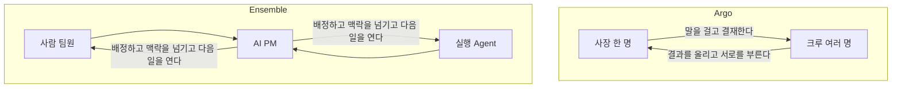
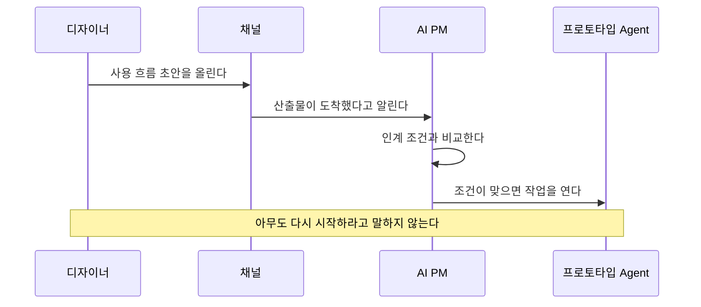

# Argo와 Ensemble

이 문서는 Argo와 Ensemble을 나란히 설명한다. Argo의 내부 구조는 `argo-structure.md`, Ensemble이 규칙으로 남기는 항목은 `argo-takeaways.md`에 있다.

둘 다 사람과 AI가 일을 주고받는 공간을 만든다. 누가 그 사이를 잇는지가 다르다.

## 한 줄

Argo는 사장 한 명이 AI 크루를 두고 일을 시키는 회사다. 조율은 사장의 몫으로 남아 있고, 프로그램은 대화와 기억과 결재를 붙잡아 준다.

Ensemble은 사람 여러 명과 실행 Agent가 한 팀인 프로젝트 공간이다. 조율은 AI PM이 한다. 사용자는 목표를 말하고, 중요한 판단과 자기 일을 한다.

## 누가 쓰는가

Argo의 사용자는 혼자 회사를 운영하는 사람이다. 크루는 그 사람의 AI 직원이다. 메신저에는 다른 사람을 앉힐 자리가 생겼지만, 크루를 실행하고 기억을 보관하는 본체는 여전히 소유자 한 명의 컴퓨터다.

Ensemble의 첫 사용자는 2주 단위로 아이디어를 검증하는 2명에서 5명 사이의 제품 팀이다. 사람 사이, 사람과 Agent 사이에 일이 자주 넘어간다. 그 넘어가는 일을 사람이 매번 지시하지 않게 하는 것이 제품의 목적이다. 첫 버전은 사람 둘, 실행 Agent 둘, AI PM 하나, 채널 하나다.

## 제품의 본체

Argo의 본체는 대화 엔진이다. 사장이 크루에게 말하면 크루가 회사 폴더를 읽고 결과물을 만든다. 여러 크루를 쓰더라도, 누구에게 넘길지는 사장이 말하거나 크루가 서로를 부른다. 목표를 듣고 역할 묶음을 제안하는 전담 자리는 없다. 메신저의 팀 작업은 역할 문구에 총괄이라는 말이 있으면 그 크루를 고르는 정도다.

Ensemble의 본체는 AI PM이다. 채널은 사람과 Agent가 말하고 결과물을 올리는 자리다. 기억은 채팅을 쌓아 둔 폴더가 아니라, 목표와 결정과 증거와 남은 일을 담은 원장이다. PM은 목표와 완료 조건을 정리하고, 역할에 맞춰 일을 나누고, 필요한 맥락만 넘기고, 결과물을 보고 다음 일을 열거나 수정을 요청하고, 막힌 이유와 물어볼 사람을 찾고, 방향이 바뀌면 영향받는 일을 표시한다.

## 사람과 Agent의 자리

Argo에서 사람은 사장이다. 크루가 초안을 만들면 사장이 결재한다. 메일을 밖으로 보내는 일은 크루가 하지 않고 사람이 한다. 오피스에서 글을 크루에게 떨어뜨려 맡기는 동작은 화면에만 있다.

Ensemble에서 사람은 결재만 하는 관리자가 아니다. 인터뷰, 판단, 설계처럼 사람의 일이 작업으로 존재한다. 디자이너가 사용 흐름 초안을 채널에 올리면, 그 초안은 사람 담당자의 결과물이다. PM은 그 결과물을 인계 조건과 비교한다. 조건에 맞으면 기다리던 실행 Agent의 일을 연다. 빠졌으면 무엇을 고칠지 말하고, 보완된 뒤에 연다.

## 다음 일이 시작되는 방식

Argo에서 다음 대화가 열리는 계기는 여러 개다. 결재 승인, 크루가 동료를 부름, 예약 시각, 메신저에서 다음 크루로 넘김이다. 팀 작업이 막히면 새 담당은 생기지 않고 사람이 재개한다. 작업 목록 화면은 이 흐름을 조종하지 않는다. 보여주는 창이다.

Ensemble에서 다음 일은 승인된 계획 안에서만 스스로 이어진다. 계획에 없는 일, 범위 변경, 공개, 비용, 되돌리기 어려운 행동은 결정권자에게 묻는다. 채팅의 문장은 후보로 남는다. 확정은 결정권자의 확인이거나, PM이 물어서 받은 답이다.

위 그림은 Ensemble의 첫 데모다. Argo에는 이 데모를 담당하는 역할이 없다. 사장이 "이제 다음 크루"라고 말하거나, 크루가 다음 크루를 직접 불러야 한다.

## 완료를 인정하는 방식

Argo에서 크루가 끝났다고 말하면 대화가 그 상태로 남거나, 메신저 팀 작업의 표식이 완료와 막힘을 가른다. 결재는 위험한 행동의 허가다. 결과물이 목표의 조건을 통과했는지를 재는 별도의 증거 단계는 없다.

Ensemble은 완료를 두 층으로 나눈다. 담당자가 산출물을 올리면 자기보고다. PM이 인계 조건을 확인하면 다음 일이 시작될 수 있다. 인수 조건이 통과가 되려면 사람 승인이나, 나중의 시스템 증거가 필요하다. 자기보고만으로 통과가 되지 않는다. 작업이 모두 끝나도 인수 조건이 비어 있으면 목표는 아직 달성되지 않은 것이다. 차이는 모델이 아니라 정해진 계산이 센다.

## 기억이 남는 방식

Argo의 회사 지식은 컴퓨터 안의 저널과 노트다. 채널 지식은 클라우드의 조직 문서와 일지다. 둘은 일부러 섞지 않는다. 대화에 넣는 양은 역할 카드, 채택된 규칙, 최근 몇 턴, 조직 문서의 일부로 제한된다. 크루의 답글은 일지에 폭넓게 쌓인다.

Ensemble의 지식은 원장 하나다. 목표, 요구사항, 인수 조건, 결정, 증거, 아직 열린 질문이 거기에 있다. 채널과 상태 패널은 그 원장을 다르게 보여 주는 창이다. 담당자에게 넘기는 맥락은 확정된 것과 이번 작업에 필요한 것만 담는다. 답글을 모두 기억으로 쌓지는 않는다.

Argo가 기억을 두 곳에 두고 맞추는 이유는 컴퓨터에서 실행하고 메신저만 클라우드에 두었기 때문이다. Ensemble은 실행을 호스팅하지 않고, 지시와 기록과 판정을 서버에 둔다. 그래서 기억의 집이 하나면 된다.

## 권한

Argo의 웹 콘솔은 회사 주인 한 명이다. 메신저는 주인, 관리자, 멤버, 손님으로 나뉜다. 크루가 채널에 글을 쓰려면 그 크루 주인의 로그인이 필요하다. 위험한 셸과 조직 문서 변경은 결재다.

Ensemble의 첫 버전에서 결정권자는 한 명이다. 목표와 계획과 결정의 확정은 그 사람의 권한이다. 검증 승인은 결정권자나 그가 지정한 검토자가 한다. 실행 Agent는 산출물을 보고할 수 있고, 결정과 배정과 통과 판정은 할 수 없다. 사람의 일정은 그 사람이 조정한다.

## 나란히 보면

| 주제 | Argo | Ensemble |
|---|---|---|
| 누구의 도구인가 | 사장 한 명과 그의 AI 크루 | 사람 팀과 실행 Agent, 조율은 AI PM |
| 본체 | 대화 엔진 | AI PM |
| 사람의 일 | 지시와 결재 | 지시, 판단, 그리고 인터뷰·설계 같은 실제 작업 |
| 다음 일의 계기 | 결재, 크루의 호출, 예약 | 승인된 계획 안의 인계 |
| 채팅의 문장 | 크루에게 일을 시키는 말 | 후보. 확정은 따로 있다 |
| 완료 | 크루의 종료 표시와 결재 | 자기보고, 인계 확인, 증거에 의한 통과가 분리된다 |
| 기억의 집 | 컴퓨터 폴더와 클라우드 문서 | 원장 하나 |
| 기록의 창 | 콘솔, 메신저, 오피스 업무판 | 채널과 상태 패널 |
| 실행이 일어나는 곳 | 사장 컴퓨터 | Ensemble 밖. Ensemble은 결과를 받아 판정한다 |
| 크루끼리 호출 | 있다. 횟수 제한이 있다 | 첫 버전에는 없다. PM이 넘긴다 |

## 서로 비어 있는 곳

Argo에 있고 Ensemble의 첫 버전에 없는 것은 예약 반복, 기술 마켓, 컴퓨터에서의 파일 실행, 여러 모델 초안 경쟁, 바깥 메신저 정문이다.

Ensemble에 있고 Argo에 없는 것은 전담 PM, 목표에서 역할 묶음을 제안하는 일, 사람 담당자의 작업을 기다렸다가 다음 Agent를 여는 일, 자기보고와 통과를 가르는 증거, 작업이 모두 끝나도 목표가 남을 수 있다는 표현이다.

그래서 Ensemble은 Argo의 메신저를 팀용으로 키운 제품이 아니다. Argo가 사장과 크루 사이에 붙여 둔 채널, 카드, 잠금, 기억의 칸, 권한 등급을 재료로 삼고, 그 위에 PM과 원장을 본체로 둔 제품이다.
