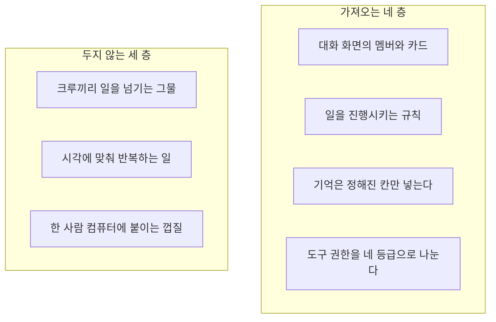
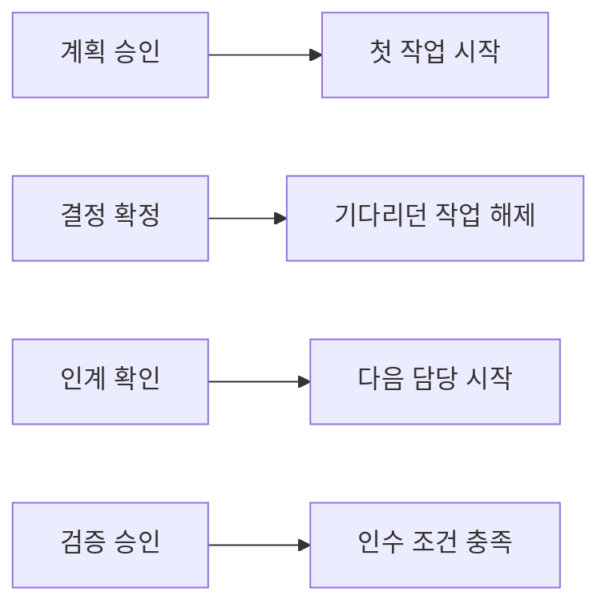

# Argo에서 가져올 것

이 문서는 Ensemble이 Argo의 동작 가운데 무엇을 규칙으로 가져오고, 무엇을 두지 않는지 정한다. Argo의 구조는 `argo-structure.md`, Ensemble과의 차이 설명은 `argo-ensemble-comparison.md`에 있다.

Argo의 코드, SQL, 프롬프트 문장은 가져오지 않는다. 여기 있는 것은 규칙이다. Ensemble의 기록 정본은 이미 정한 Product State 원장이다. Argo의 파일과 테이블을 그대로 만들지 않는다.

## 결론

대화 화면만 가져오면 부족하다. Argo 전체를 가져오지도 않는다.

Argo는 일곱 층이다. Ensemble이 가져오는 것은 그중 네 층의 규칙이다. 나머지 세 층은 두지 않거나, 횟수 제한만 남긴다.

크루끼리 넘기는 장치에서는 횟수 제한만 가져온다. 넘기는 길 자체는 만들지 않는다. 일을 넘기는 주체는 AI PM이다.

## 가져오는 규칙

### 1. 사람과 Agent는 같은 채널의 멤버다

Argo 메신저는 사람과 크루를 한 명단에 두고, 종류만 사람인지 크루인지로 구분한다. 메시지도 사람, 크루, 시스템으로 나뉜다. 결재는 대화 안의 카드다. 실시간으로 오가는 신호에는 본문을 실지 않고, 본문은 권한을 확인한 뒤 다시 읽는다. 같은 답글이 두 번 생기지 않게 식별자를 둔다.

Ensemble의 첫 버전은 채널이 하나다. 멤버 종류는 사람, 실행 Agent, AI PM이다. 계획 승인, 검증 승인, 결정 확인, 목표 승인 카드는 그 채널 안에 있다. 채널 옆의 상태 패널은 다른 기록이 아니다. 둘 다 같은 원장을 보여 준다.

사고 과정을 채널에 쏟아 붓지 않는 점은 따른다. 다만 PM이 지금 누가 무엇을 하는지 말하는 상태 카드는 채널에 남긴다. Argo처럼 진행 표시를 거의 없애면, Ensemble이 보여 줘야 하는 인계가 보이지 않는다.

크루의 권한을 그 크루를 만든 사람 한 명의 로그인으로 묶는 방식은 따르지 않는다. Ensemble의 Agent는 팀 소속이다.

### 2. 확정에는 후속이 있거나, 없음이 정해져 있다

Argo는 결재가 승인되면 종류에 따라 새 대화를 딱 한 번 열거나, 일부러 열지 않는다. 일반 행동과 영입과 문서 변경은 후속이 있다. 반복 일정을 다시 켜는 결재는 후속 대화가 없다.

Ensemble에서는 이 규칙을 대화가 아니라 원장 사건에 건다.

검증 승인은 제품이 그 조건을 통과했는지만 바꾼다. 다음 담당의 시작은 이미 인계 확인에서 일어난다. 한 사건이 일을 두 번 시작하지 않게 실행권을 잠근다. 잠금의 기준은 메시지 번호가 아니라 작업의 상태 변화다.

끝 보고 없이 실행이 멈추면 완료가 아니다. Argo는 이런 일을 막힘으로 두고 사람을 기다린다. Ensemble도 같다. 보고가 없으면 작업은 막힌 상태가 되고, 사람이 재개하기 전에는 다른 담당자를 만들지 않는다.

AI PM이 사람 확인 없이 잇는 행동에는 횟수 제한을 둔다. 제한에 닿으면 멈추고 결정권자에게 알린다. Argo의 숫자는 메신저 기준이다. 크루에서 크루로는 여덟 번, 10분에 자동 턴 스무 번, 한 번에 넘김 두 번이다. Ensemble은 크루 사슬이 없으므로 같은 숫자를 복사하지 않고, PM 루프에 상한을 둔다는 규칙만 가져온다.

채팅 마지막 줄의 표식으로 상태를 바꾸는 방식은 가져오지 않는다. 상태 변경은 정해진 도구와 권한으로만 한다.

### 3. 기억은 정해진 칸만 넘긴다

Argo는 기억 폴더 전체를 모델에게 넣지 않는다. 한 번의 대화에 들어가는 칸은 정해져 있다. 역할 카드, 채택된 회사 규칙, 최근 대화 몇 턴, 조직 문서의 일부, 이번 메시지와 첨부다. 본문이 길면 자를 위치를 정해 둔다. 규칙이 되려면 사람이 채택해야 한다. 채팅에 있던 문장이 저절로 다음 규칙이 되지는 않는다.

Ensemble의 정본은 파일이 아니라 원장이다. 저널 파일, 노트 파일, 밤에 글을 합치는 작업은 만들지 않는다. 가져오는 것은 칸의 계약이다.

한 담당자에게 넘길 때 넣는 것은 다음뿐이다.

- 그 사람의 역할
- 이미 확정된 결정과 제약
- 이번 작업이 맞출 인수 조건
- 앞사람이 올린 산출물의 위치
- 최근 채널 대화의 일부
- 이번 첨부

원장 전체와, 아직 확정되지 않은 후보는 넣지 않는다. 사람의 수정이 두 번 쌓이면 규칙으로 제안하는 감지는 첫 버전에 넣지 않는다. 첫 버전에서는 결정권자가 확인한 결정만 다음 칸에 들어간다.

### 4. 도구는 네 등급이다

Argo는 크루가 파일을 읽고, 파일을 고치고, 바깥에 영향을 주고, 회사 규칙을 바꾸는 일을 같은 권한으로 취급하지 않는다. 바깥 영향과 규칙 변경은 결재를 거친다. 다른 회사와 비밀번호와 제어 파일은 막는다. 손님 크루는 크루용 도구만 쓴다.

Ensemble은 셸, 브라우저, 컴퓨터 조작, 모델 프로그램 교체를 호스팅하지 않는다. 그 구현은 가져오지 않는다. 등급만 가져온다.

| 등급 | Ensemble에서 허용되는 쪽 |
|---|---|
| 읽기 | 이번 작업에 필요한 맥락과 앞 산출물 |
| 산출 | 완료 보고와 첨부. 이것만으로 검증은 통과하지 않는다 |
| 바깥 영향 | 공개, 비용, 되돌리기 어려운 행동. 결정권자 확인이 필요하다 |
| 규칙 변경 | 결정과 계획의 변경. 결정권자만 한다 |

실행 Agent는 산출 등급까지다. 배정, 결정 확정, 검증 판정, 원장 직접 쓰기는 PM 도구이고 실행 Agent에게 열지 않는다.

## 두지 않는 것

아래는 Argo에 있지만 Ensemble의 첫 버전과 그 다음 설계에 두지 않는다.

- 크루가 크루를 직접 부르고, 메일 큐로 넘기고, 회의실에서 돌려 말하고, 같은 초안을 여러 모델에 시켜 고르는 장치. 배정은 승인된 계획 안에서 AI PM이 한다. Agent끼리의 검토 절차는 Argo에도 완료를 판정하는 장치로 존재하지 않는다. 첫 버전에 만들지 않는다.
- 시각이 되면 다시 일하는 예약과 반복 루프. 첫 사이클의 일은 계획에 적힌 작업의 순서다. 상한에 닿으면 멈추고 사람에게 묻는 태도는 PM의 횟수 제한으로만 남긴다.
- 한 사람 컴퓨터에 회사를 두고 기기를 묶고 폴더를 동기화하는 구조. Ensemble의 정본은 서버의 원장이다.
- 사용자가 직접 연결한 모델 키로 여러 실행기를 갈아 끼우는 층, 기술 마켓, 외부 서비스 비밀 저장, 텔레그램을 정문으로 쓰는 연결. 바깥 메신저는 나중에 출입구로 검토할 수 있다. 기록의 정본은 아니다.
- 오피스의 메일과 글 편집기. 오피스 업무판이 메신저 기록을 다시 보여 준다는 점만, 채널과 상태 패널의 관계로 이미 반영했다.
- 회사 폴더와 클라우드에 같은 일을 두 번 적어 두고 맞추는 구조. Argo는 결재, 기억, 예약이 각각 두 벌이다. Ensemble은 원장을 하나로 둔다.

## 첫 버전에 문서로 고정할 것

Product State에 이미 있는 것은 다시 설계하지 않는다. 원장, 차이의 계산, 인계 확인과 검증 통과의 분리, 계획 안에서의 자동 인계, 역할 틀 하나가 그것이다. Argo를 보고 첫 버전에 더 적어 둘 것은 아래 일곱 가지다.

1. 채널 멤버의 종류와, 채널 안에 놓이는 카드. 상태 패널은 같은 원장의 다른 창이다.
2. 작업이 한 상태에서 다음 상태로 넘어갈 때 실행권은 하나다. 같은 확인으로 다음 Agent가 두 번 시작되지 않는다.
3. 확정 사건마다 후속은 없거나 하나다. 위의 그림이 그 대응이다.
4. 끝 보고가 없으면 작업은 막힌다. 재개 전에는 담당을 바꾸지 않는다.
5. AI PM이 스스로 잇는 행동에 횟수 상한이 있다. 상한에 닿으면 결정권자에게 알린다.
6. 담당자에게 넘기는 맥락의 칸이 위에 적은 목록으로 고정된다.
7. 실행 Agent의 도구는 산출까지다. 원장 쓰기와 배정과 검증 판정은 열지 않는다.

## 한 줄로

화면의 모양은 Argo 메신저에서 온다. 일이 이어지는 보장, 기억의 칸, 도구의 등급도 함께 온다. 파일을 복사하거나, 크루가 서로를 부르는 그물이나, 컴퓨터 한 대에 회사를 두는 구조는 오지 않는다.
