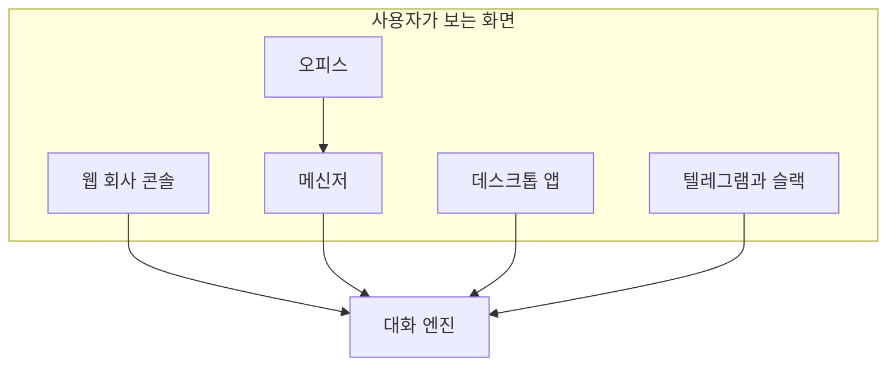
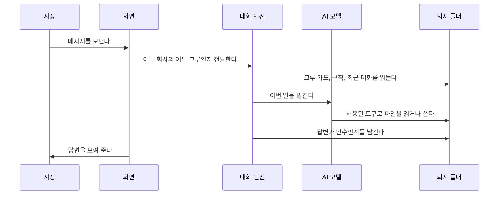
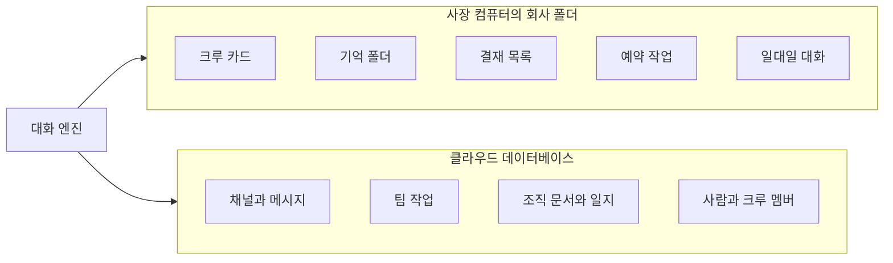
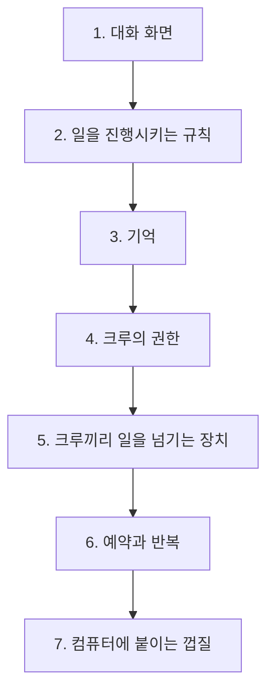

# Argo의 구조

> 과거 참고 프로젝트의 구조 조사다. Ensemble의 현재 제품 정의는 [intent.md](../../intent.md)의 PM Agent와 여섯 역할을 따른다. 아래 비교 대상의 중앙 공간·역할 구성은 Ensemble의 필수 제품 형태가 아니다.

이 문서는 2026-09-28 당시 Argo의 구조를 조사한 참고 자료다. Ensemble의 제품 방향이나 구현 규칙은 정하지 않는다. 현재 방향은 [intent.md](../../intent.md), 현재 구조는 [아키텍처](../mvp-architecture.md)를 따른다.

조사 기준은 2026-09-28, Argo 0.1.88이다. Argo 코드는 열어 볼 수 있지만 오픈소스 라이선스가 아니다. 이 문서는 동작을 설명만 하고, 문장과 코드를 옮기지 않는다.

## Argo가 하는 일

Argo는 한 사람이 AI 직원 여러 명에게 일을 시키는 프로그램이다. 사용자는 사장이다. 작업 공간은 회사다. AI 직원은 크루다. 대화와 결과물이 쌓이는 폴더는 기억이다. 여러 크루가 함께 이야기하는 방은 회의실이다. 위험한 일을 사람이 허락하는 절차는 결재다.

사장이 한 줄로 크루를 만들고, 그 크루에게 회사 폴더를 기억 삼아 일을 시킨다. 크루가 글을 쓰고 파일을 고치고 다른 크루에게 일을 넘기는 계산은 사장 컴퓨터에서 돈다. 클라우드에 올라가는 것은 기기 사이 동기화와 팀 메신저다.

## 사용자가 만나는 화면

Argo는 화면이 여러 개이고, 일을 처리하는 속은 하나다.

| 화면 | 하는 일 |
|---|---|
| 웹 회사 콘솔 | 크루를 만들고, 한 명과 대화하고, 기억과 예약과 결재를 본다 |
| 메신저 | 사람과 크루가 같은 채널에서 이야기한다. 컴퓨터, 휴대폰에서 연다 |
| 오피스 | 메일, 페이지, 업무, 결재, 일지를 한 화면에 모은다. 아직 초기 단계다 |
| 데스크톱 앱 | 웹 콘솔을 컴퓨터 앱으로 감싼 것이다 |
| 텔레그램·슬랙 연결 | 바깥 메신저에서 온 말을 같은 대화 엔진으로 넘긴다 |

아래 그림은 화면이 달라도 대화 엔진 하나로 모이는 구조를 나타낸다.

오피스는 메신저와 다른 일을 저장하지 않는다. 오피스의 업무, 결재, 일지 화면은 메신저가 이미 가진 기록을 다시 보여 주는 창이다. 메일과 글 페이지는 오피스만의 기록이다. 메일의 글을 크루에게 맡기는 버튼은 화면에만 있고, 아직 작업을 만들지는 않는다.

## 한 번의 대화가 지나가는 길

사장이 크루에게 말을 걸면 아래 순서로 진행된다.

메신저에서 온 말도 같은 대화 엔진을 탄다. 다른 점은 앞뒤다. 메신저는 클라우드의 채널에서 말을 꺼내고, 답글을 다시 채널에 넣는다. 웹 콘솔은 회사 폴더의 대화 파일을 읽고 쓴다.

대화 엔진이 모델에게 넘기는 내용에는 자리가 정해져 있다. 크루의 역할 카드, 회사가 채택한 규칙, 최근 대화 몇 턴, 이번 메시지와 첨부다. 기억 폴더 전체를 통째로 넣지는 않는다. 크루는 목록을 본 다음 필요한 파일만 도구로 연다.

모델이 막히면 Argo는 오류를 종류로 나눈다. 로그인이 풀렸거나 응답이 잠기면 다른 모델로 한 번 더 시도한다. 예산이 다하면 모델을 부르지 않는다. 답 없이 멈춘 턴은 실패로 정리한다.

## 기록이 쌓이는 곳

기록은 두 곳에 있다. 이 두 곳은 서로를 완전히 대신하지 않는다.

회사 폴더의 기억은 세 겹이다.

1. 저널은 크루가 일을 마칠 때마다 붙는 원문이다. 답변은 길이를 잘라 남긴다.
2. 노트는 저널을 주제별로 다듬은 글이다. 밤에 프로그램이 저널을 읽어 노트로 합친다. 합치기에 실패하면 그 위치는 다음으로 넘기지 않는다.
3. 목록 파일은 노트와 저널의 목차다. 목차는 언제든 다시 만들 수 있다. 정본은 노트와 저널이다.

사람이 크루의 결과를 고친 말이 반복되면, Argo는 그것을 규칙 후보로 쌓는다. 같은 지적이 두 번 이상이면 제안이 된다. 사장이 채택해야 회사 규칙 파일에 들어가고, 그 다음 대화부터 적용된다. 채팅에 남아 있는 것만으로는 규칙이 되지 않는다.

메신저의 기억은 따로다. 채널에서 오간 크루의 답글은 조직 일지에 쌓이고, 크루가 채널에서 일할 때 그 일지의 끝부분과 조직 문서만 넘겨받는다. 이 기록은 사장 컴퓨터의 기억 폴더와 섞지 않는다.

## 일이 진행되는 장치

Argo에서 "다음 일"은 작업 표 한 장이 알아서 굴러가는 구조가 아니다. 여러 장치가 각자 다음 대화를 만든다.

결재는 대기, 승인, 거절, 만료의 네 상태다. 종류마다 승인 뒤의 일이 다르다. 일반 행동, 크루 영입, 조직 문서 변경은 승인 뒤에 새 대화가 한 번 더 열린다. 반복 작업을 다시 켜는 결재는 새 대화를 만들지 않고 예약만 살린다.

팀 작업은 메신저에만 있다. 상태는 진행, 막힘, 완료, 취소다. 크루의 답이 형식에 맞지 않거나 오래 소식이 없으면 막힘으로 바뀐다. 막힌 일은 사람이 재개하거나 취소한다. 프로그램이 다른 크루를 알아서 지명하지는 않는다.

같은 말에 두 번 답하지 않게, 메신저는 크루와 원본 메시지를 짝으로 실행권을 잠근다. 일정 시간이 지나도 그 잠금은 다른 기기로 넘어가지 않는다.

크루끼리 일을 넘기는 길은 세 가지다. 같은 대화 안에서 동료를 바로 부르는 길, 메일처럼 큐에 넣어 나중에 전달하는 길, 메신저에서 다음 크루의 차례를 예약하는 길이다. 각 길에는 횟수 제한이 있다. 한 턴에 넘김은 둘까지다. 메신저에서 크루에서 크루로 이어지는 고리는 여덟 번에서 멈춘다. 자동으로 일어나는 크루 턴은 10분에 회사당 스무 번에서 멈춘다.

예약 작업은 매일, 매주, 한 번, 또는 간격으로 대화를 다시 연다. 반복 루프는 횟수나 금액 상한에 닿으면 멈추고, 다시 돌릴지는 결재로 묻는다.

웹 콘솔의 작업 목록 API는 이 장치들과 별개다. 그 API는 지금 도는 턴과 최근 사건을 보여 줄 뿐, 담당을 정하거나 다음 일을 시작하지 않는다.

## 크루가 할 수 있는 일의 한계

크루 카드는 이름, 역할, 쓸 모델, 허용된 기술 목록을 담은 파일이다. 본문에는 전문성, 일하는 방식, 말투가 있다.

도구는 네 갈래로 나뉜다.

| 갈래 | 예 |
|---|---|
| 그냥 해도 되는 일 | 회사 폴더를 읽고 쓰기, 일정을 보기 |
| 결재가 필요한 일 | 밖에서 효과가 나는 행동, 크루를 새로 들이기, 조직 문서 바꾸기 |
| 막혀 있는 일 | 다른 회사 폴더, 비밀번호 파일, 프로그램 자신의 제어 파일 |
| 손님 크루에게 막힌 일 | 셸과 파일 전체. 손님은 크루용 도구만 쓴다 |

파일을 고치고 명령을 실행하고 브라우저를 여는 일은 사장 컴퓨터에서만 일어난다. 클라우드의 모델에게 말을 시켜도, 손과 발은 그 컴퓨터에 있다.

## 프로그램을 이루는 일곱 층

아래 그림은 위에서 말한 내용을 층으로 접은 것이다. 위층이 사용자가 보는 면이고, 아래층일수록 한 사람의 컴퓨터에 묶인다.

1. 대화 화면은 채널, 멤버, 메시지, 결재 카드, 첨부다.
2. 일을 진행시키는 규칙은 결재 뒤의 후속 대화, 팀 작업의 막힘, 실행권 잠금, 횟수 제한이다.
3. 기억은 저널, 노트, 채택된 규칙, 메신저 조직 문서다.
4. 권한은 읽기, 파일 수정, 바깥에 영향을 주는 행동, 조직 규칙을 바꾸는 행동을 나눈다.
5. 넘기는 장치는 바로 부르기, 메일 큐, 메신저 핸드오프, 회의실, 같은 일의 초안 경쟁이다.
6. 예약과 반복은 시각이 되면 다시 대화를 연다.
7. 껍질은 기기 등록, 폴더 동기화, 모델 키 보관, 기술 마켓, 결제, 데스크톱 포장이다.

## 코드가 놓인 자리

구현을 찾을 때는 아래 폴더를 본다. 이 문서의 설명은 이 폴더들의 동작을 엮은 것이다.

| 폴더 | 들어 있는 것 |
|---|---|
| `src/` | 대화 엔진, 기억, 결재, 예약, 권한, 메신저 연결 |
| `app/` | 웹 콘솔과 그 API |
| `apps/messenger/` | 팀 메신저 앱 |
| `apps/office/` | 오피스 앱 |
| `supabase/` | 메신저용 데이터베이스 정의 |
| `integrations/` | 바깥 에이전트를 메신저에 붙이는 어댑터 |
| `src-tauri/` | 데스크톱 앱의 껍질 |

## 이 구조에서 기억할 점

Argo의 중심은 대화 엔진 하나다. 화면은 여러 개이고, 기록은 회사 폴더와 클라우드 두 곳이다. 다음 일은 작업 표가 아니라 결재, 넘김, 예약이 각각 새 대화를 열어서 이어진다. 팀 작업이라는 이름 있는 단위는 메신저에만 있고, 막히면 사람을 기다린다.
