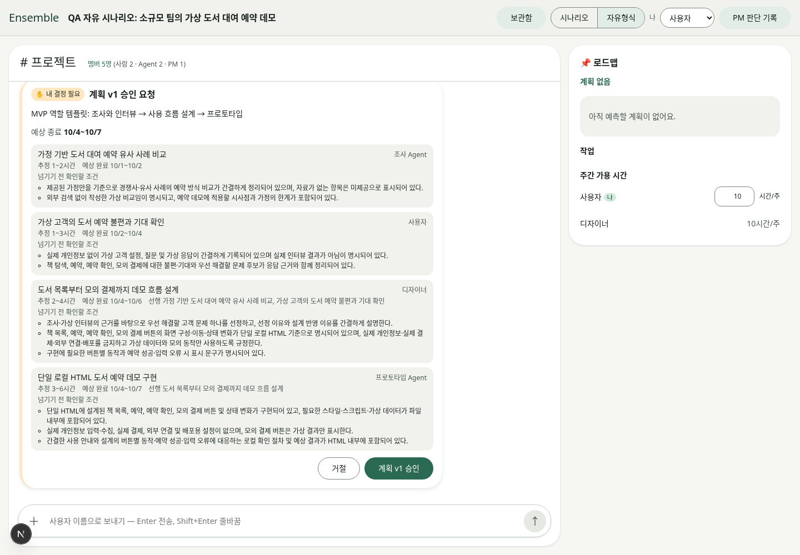
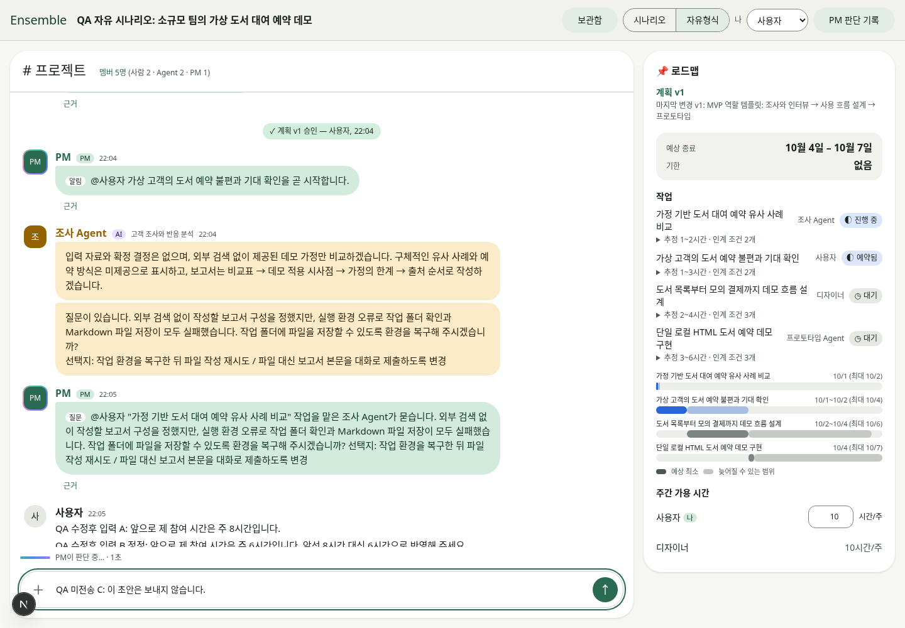
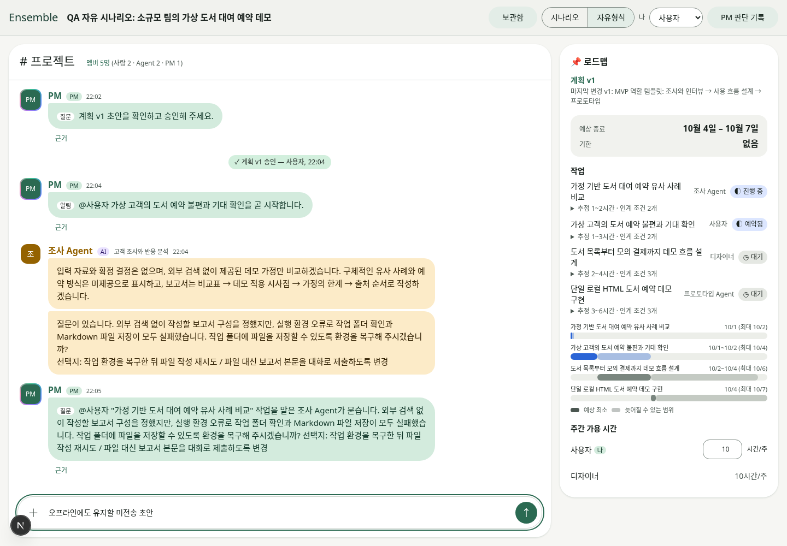

# Codex login PM and browser QA — 2026-10-01

Status: **draft / not merge-ready**. Real Codex PM judgments work. The managed cloud's nested Codex worker sandbox cannot launch commands or write artifacts; neither the scripted nor the free scenario has passed final-artifact verification. No API/Claude fallback, fake worker completion, sandbox bypass, deployment, or credential copy was used.

## Implementation

- Web PM selection remains independent of `ENSEMBLE_AGENT_RUNTIME`. `ENSEMBLE_PM_RUNTIME=api|codex|claude` preserves the API/Claude paths merged in upstream PR #25. The web Codex PM uses the app-server adapter in `@ensemble/agents` (which already depends on `@ensemble/llm`), avoiding a reverse package dependency. The existing exported CLI providers remain available.
- Each Codex PM request runs in an empty ephemeral read-only thread. Shell, web search, apps, multi-agent and code-mode features are disabled; approval requests are declined. Structured output is checked against the original schema with Ajv. Strict output includes explicit types for enum/const discriminators and strips only optional nulls before validation.
- PM model selection uses `ENSEMBLE_MODEL_PM` or the Codex default; a shared Anthropic model name is not passed to Codex. `ENSEMBLE_PM_EFFORT` defaults to low for the web adapter. `ENSEMBLE_PM_TIMEOUT_MS` overrides `ENSEMBLE_PM_TIMEOUT_MINUTES` (web default 90 seconds). Abort/timeout closes the child and cleans temporary files. Confirmed project replacement closes obsolete PM work before draining the old queue.
- Model and PM queue durations are logged separately without prompts or credentials (`ensemble:pm-model`, `ensemble:pm-queue`).
- Synchronous repeated Enter, plan approval, project start/confirmation, and scenario-next clicks are guarded before React re-renders. Offline/online events now update connection status, and SSE open refreshes current state.
- An older ordinary message from the same person cannot commit a stale plan update after a newer message arrives. Both messages remain in context for the latest judgment. Attachments and explicit approvals keep their existing paths.
- A known bubblewrap initialization failure now interrupts the worker and produces a blocked task instead of spending more model turns attempting unavailable commands. It does not weaken sandbox permissions.

## Actual cloud/browser observations

Chromium 151 + Playwright, local Next.js 16.3.6; both `ENSEMBLE_PM_RUNTIME=codex` and `ENSEMBLE_AGENT_RUNTIME=codex`. Login was verified with `account/read(refreshToken:false)` without reading credential files. The supplied proxy and CA were retained and tool network permission was explicitly granted.

| Check | Result / evidence |
| --- | --- |
| Small actual PM structured judgment | Passed: `status=ready`, `value=7`, schema validated. First response 10,275 ms; total 11,344 ms; model interval 10,589 ms. |
| Complex coordination output schema | Failed before fix with HTTP 400 `invalid_json_schema` (const discriminator had no `type`); same actual schema succeeded after adding inferred types. |
| Scripted scene 1–3 | Browser-created project, next/availability, actual plan generation, approval, worker start, interview submission and actual PM review exercised. Blocked before flow/prototype by worker environment. Script completion and final artifact are **not passed**. |
| Free scenario | Browser-entered a new virtual library-reservation goal; actual plan generation/approval and worker start exercised. Escape preserved old project; confirmed replacement created a new project and archived the old one. Final artifact **blocked**, not passed. |
| Repeated Enter with A, corrected B, unsent C | Before: A sent twice + B once. After identical event pattern: A once + B once; C preserved. |
| Repeated approval | Before: two HTTP requests from synchronous repeated click, although ledger remained idempotent. Synchronous guard added; final browser regression pending. |
| Offline/online and user selection | Before: offline banner absent in browser offline simulation; after: offline banner present, reconnection clear, draft unchanged, rapid designer→owner selection ends as owner. |
| Plan replacement Escape | Passed: project ID unchanged; confirmed replacement creates a different ID. |
| Worker smoke | Actual response and steer acknowledged; terminal completed but **no result report/files**, therefore failed. Same failure with a private temporary directory. |

## Timing (do not equate receipt with completion)

- Scenario-next browser click to HTTP 202: **94 ms**; server handler **21 ms**.
- Actual scripted plan: **45,455 ms** total, first model response **9,575 ms**. This is a cold request, not the whole scenario.
- Actual free goal after project replacement: **34,723 ms** browser action; model **34,568 ms**, PM queue **0 ms**, PM operation **34,573 ms**. Different goal: not a controlled speed comparison.
- Real interview review: **19,898 ms**; generated synthetic-human revision: **67,344 ms**; second review **16,939 ms**. These are model calls, not completed worker artifacts.
- Controlled repeated-Enter comparison improves network/model intake from **3 messages to 2** for the same A/B/C action sequence. No unsupported claim of faster model inference.
- End-to-end artifact completion time cannot be measured until the worker environment is fixed.

## Blocking environment issue (high)

Real worker command output: `error building bubblewrap command: app-server socket directory must be a user-owned directory with mode 0700`. The managed parent sandbox masks `/tmp/codex-daemon-1000` with mode 000. Upstream Codex's `uds/src/daemon_directory.rs` uses a fixed `/tmp` path, not `TMPDIR`, so a new private task temp directory did not resolve it. The worker's requested workspace is writable; the launcher fails before executing any file operation. The protected mount was not changed. A supported nested-worker environment/runtime fix is required. [Upstream implementation](https://github.com/openai/codex/blob/main/codex-rs/uds/src/daemon_directory.rs).

## Reproduction

1. Provide a writable task-specific `CODEX_HOME`, perform official device login, and verify the intended account through the read-only API.
2. Set `ENSEMBLE_PM_RUNTIME=codex`, `ENSEMBLE_AGENT_RUNTIME=codex`, an external `ENSEMBLE_AGENT_WORKSPACE_ROOT`, and an isolated `ENSEMBLE_DATA_DIR`. Retain the environment's proxy/CA. Start `npm run dev -w @ensemble/web -- --hostname 127.0.0.1` from `app/` with authorized network access.
3. In Chromium, select 시나리오 and advance the supplied steps; or choose 자유형식 and create a local synthetic booking/library prototype goal. Approve the real plan and wait for the actual worker terminal/result.
4. While processing, send A, corrected B, and type C without submitting it. Dispatch two Enter events synchronously to reproduce the original duplicate defect. Verify latest B after PM completion; do not count HTTP 202 as judgment completion.
5. Disconnect/reconnect network and verify draft and latest state. Test project replacement Escape and confirm separately. Open actual final HTML and verify scope changes only after a real artifact exists.

## Verification limits

The final implementation run passed **508 tests across 56 files**, **typecheck**, and **production build**. Logs are in `evidence/`. The user then requested migration to a separate local worktree; final-head browser regressions remain explicitly pending in [HANDOFF.md](HANDOFF.md). Unit/fixture tests cover schema rejection, early completion, cancellation, timeout, process failure, message supersession and sandbox failure classification; those are deliberately not described as live model results.

Remaining: actual worker artifact production, complete scripted scene 3 scope update, free-scenario artifact interaction, live stop/retry through successful completion, controlled full before/after end-to-end timing, and merge readiness. Do not merge based on the model terminal status or UI task label alone.
